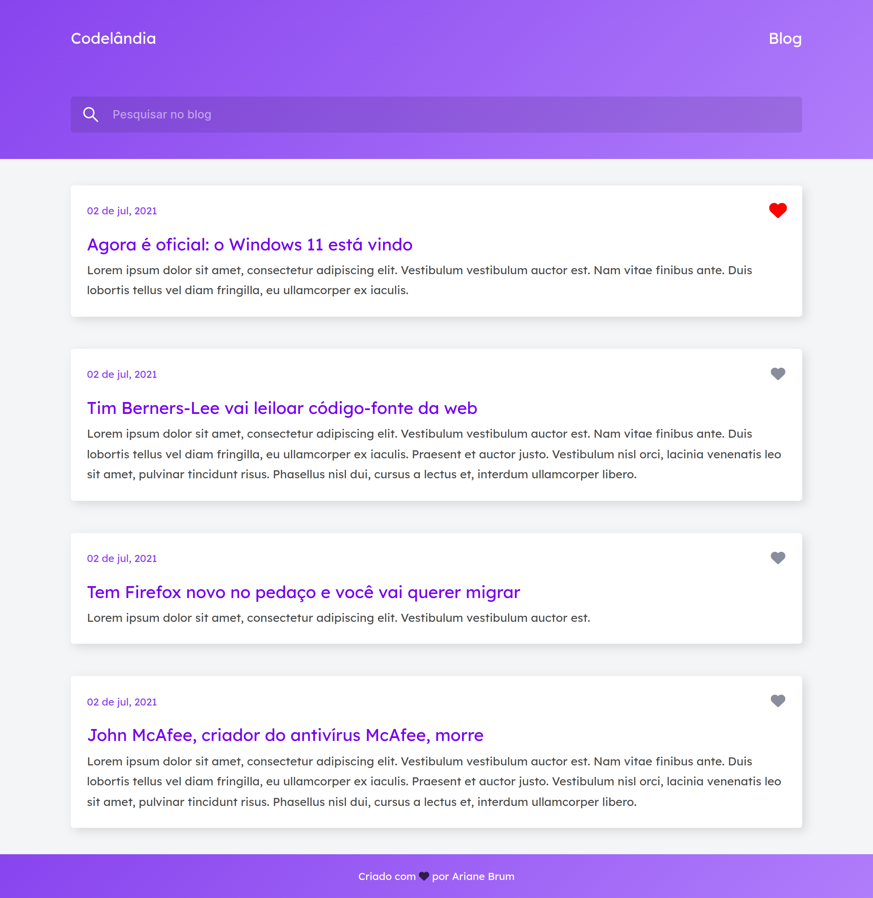

# Codelandia Blog

<h2>:dart: Desafio proposto:</h2>
<h4 >🚀 Criar layout de um blog.</h4>
<h2 id="objetivo">:art:  Design</h2>
<h4>Você pode acessar o design do projeto através do <a href="https://www.figma.com/file/Yb9IBH56g7T1hdIyZ3BMNO/Codel%C3%A2ndia-Desafios?node-id=0%3A1">Figma</a></h4>
 
  <h2 id="preview">:movie_camera: Demo</h2>

 
<h4>Clique aqui para visitar o projeto <a href="https://ariane-codelandia-blog.vercel.app/">Codelandia Blog</a></h4>
 

<h3 id="tecnologias">🛠 Tecnologias utilizadas</h3>

Esse projeto foi desenvolvido com as seguintes tecnologias:

- CSS3  
- HTML5  
- Javascript  
- Fontawesome
 

## 🦄 Autor 

<table>
  <tr>
    <td align="center">
      <a href="https://github.com/Ariane-Brum">
          
        
          <b>Ariane Brum</b>
        
      </a>
    </td>
  </tr>
</table>
